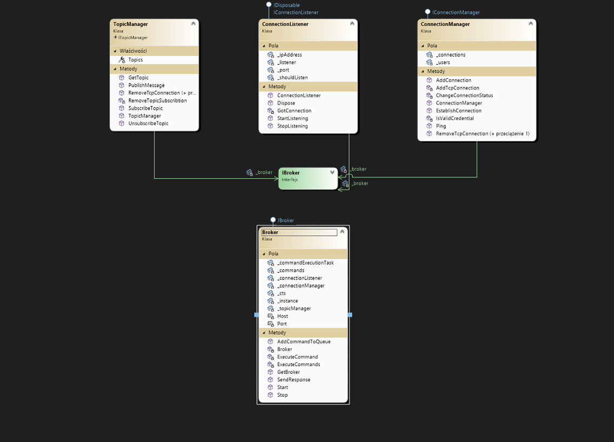
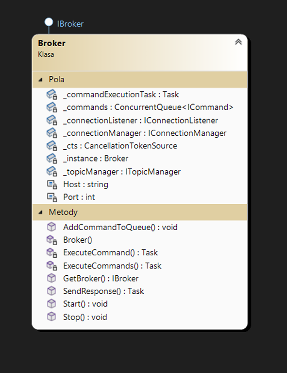
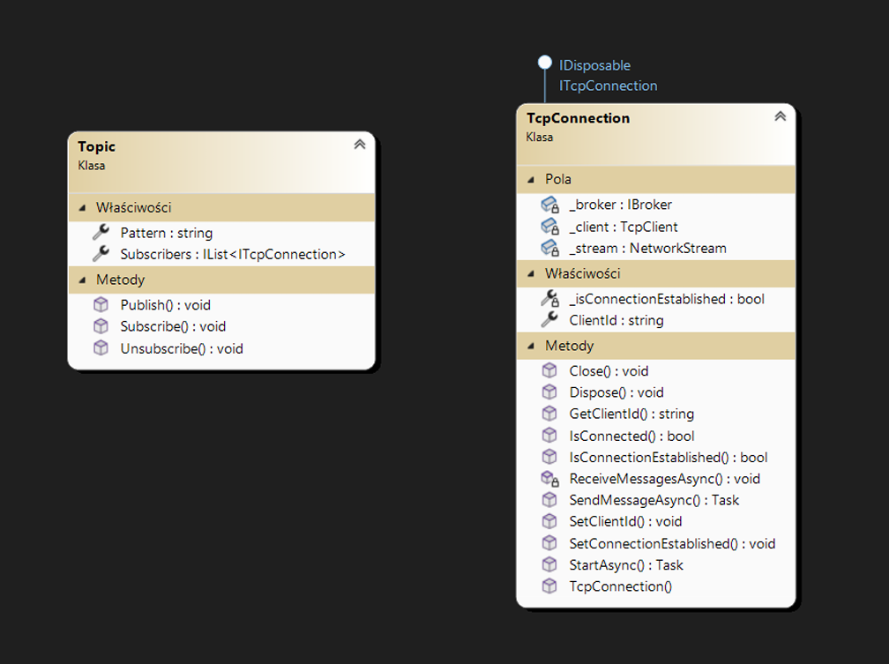
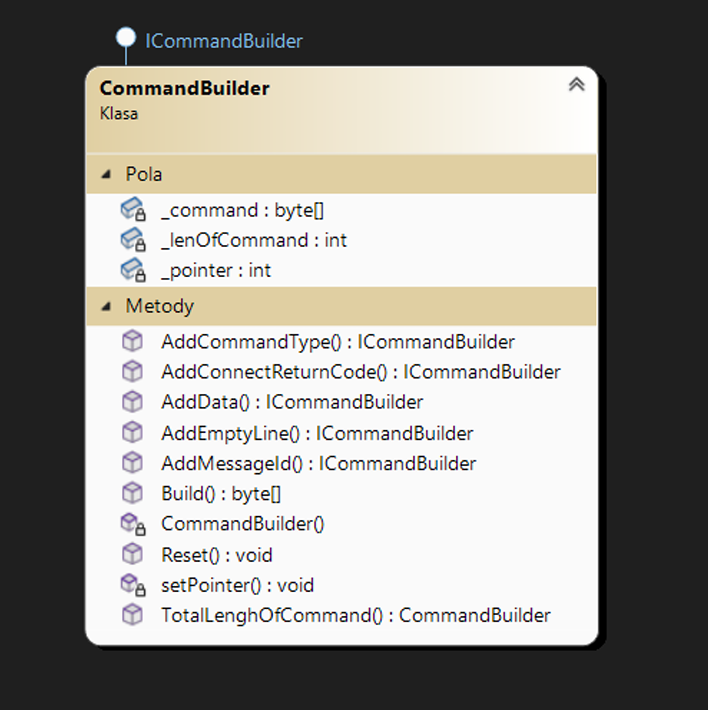

# 1.  Cel Projektu  
Celem projektu była własna implementacja Brokera MQTT w języku C#. Broker miał wspierać technologię MQTT w wersji 3.1. Założeniem projektu było wykorzystanie conajmniej trzech wzorców projektowych. W realizacji brokera wykorzystano następujące wzorce:
###    1. Mediator
###    2. Singleton
###    3. Obserwator
###    4. Budowniczy
# 2. Funkcjonalności Projektu  
Lista funkcjonalności projektu obejmuje zbiór podstawowych funkcjonalności protokołu MQTT V3.1, czyli przetwarzanie następujących wiadomości:
- CONNECT
- CONNACK
- PUBLISH
- PUBACK
- SUBSCRIBE
- SUBACK
- UNSUBSCRIBE
- UNSUBACK
- PINGREQ
- PINGRESP 
- DISCONNECT
# 3. Architektura
## 1. Architektura fizyczna
   Architektura fizyczna brokera obejmuje jedno urządzenie z uruchomioną aplikacją brokera. Jeśli chodzi o klientów, to mogą być oni zarówno hostowani na tej samej maszynie co sam broker, jak i na innych.
## 2. Architektura Logiczna
   Architektura logiczna składa się z wielu klas. Główną klasą jest broker, który zarządza pozostałymi klasami i obiektami. W implementacji architektury logicznej wykorzystano następujące wzorce projektowe:
### 1. Mediator
   Mediator jest behawioralnym wzorcem projektowym. Został on użyty w celu zredukowania chaosu zależności między obiektami klas. Wymusza on komunikację pomiędzy klasami: ConnectionListener, ConnectionManager, TcpConnection oraz TopicManager z wykorzystaniem instancji klasy Broker. Dzięki temu ograniczony został zbiór zależności pomiędzy wspomnianymi klasami, jak również ułatwione zostały ewentualne zmiany w obrębie tych klas.  
   
### 2. Singleton
   Singleton to kreacyjny wzorzec projektowy, który dba o to, aby istniała tylko jedna instancja wybranej klasy. Ponadto udostępnia globalny dostęp do instancji tej klasy. Wzorzec ten został użyty ze względu na wielowątkowość oraz uproszczone zarządzanie danymi i dostępem do nich. Wykorzystano go przy implementacji klasy Broker.  
   
### 3. Obserwator
   Obserwator, podobnie jak Mediator, jest behawioralnym wzorcem projektowym. Pozwala on zdefiniować mechanizm subskrypcji w celu powiadomiania wielu obiektów o zdarzeniach, które mają miejsce w obserwowanym obiekcie. W przypadku naszego brokera, wzorzec ten został wykorzystany przy okazji komunikacji między Topic, a odpowiednimi TcpConnections. Wówczas wszyscy klienci, którzy subskrybują dany topic, zostają poinformowani o zmianach i nowa wiadomość zostaje do nich wysłana.  
   
### 4. Budowniczy
   Budowniczy to kreacyjny wzorzec projektowy. Umożliwia tworzenie złożonych obiektów etapami. Pozwala on wykorzystywać ponownie ten sam kod, przy konstrukcji różnych, rozbudowanych obiektów. W naszym przypadku został wykorzystany przy tworzeniu klas implementujących interfejs IResponseCommand.  
   